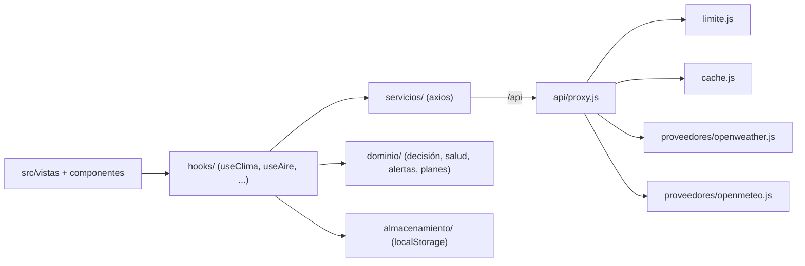

<div align="center">
  
  <h1>WeatherNow Decide</h1>
  <p><b>Clima traducido a decisiones: ¿salgo a correr, tiendo la ropa, lavo el auto? SPA en español con proxy Node propio.</b></p>
  
  
  
  
  
  
  <p>
    <a href="#-inicio-rápido">Inicio rápido</a> ·
    <a href="#-características">Características</a> ·
    <a href="#-arquitectura">Arquitectura</a> ·
    <a href="#-pruebas">Pruebas</a> ·
    <a href="#-lo-que-todavía-no-existe">Limitaciones</a>
  </p>
</div>

**WeatherNow Decide** es una aplicación web (React + Vite) que muestra el clima actual y el pronóstico de una ciudad y lo convierte en veredictos por actividad (favorable / precaución / no recomendado), junto con índice UV, calidad del aire y polen. Las llamadas a los proveedores pasan por un **proxy Node propio**, de modo que la clave de OpenWeather nunca llega al navegador. **No** es una app móvil nativa, no tiene cuentas de usuario ni pasarela de pago: el "plan Premium" es una simulación local.

## 🎬 Vista rápida

No hay capturas: el clima real requiere una clave de OpenWeather y acceso a internet, y no se muestran imágenes que no sean de la app corriendo.

```text
Buscar ciudad (o "Mi ubicación")
   └─> Proxy /api  ──> OpenWeather (clima, pronóstico) + Open-Meteo (aire, UV, polen)
         └─> Tarjeta de clima · pronóstico · gráficos · panel de salud
               └─> Decisiones: Correr / Ciclismo / Caminar / Evento / Ropa / Lavar auto
                     └─> Alertas in-app · favoritos · unidades °C/km/h ↔ °F/mph
```

## ✨ Características

| Característica | Detalle |
| :--- | :--- |
| Búsqueda y ubicación | Búsqueda por ciudad y geolocalización del navegador; recuerda el último lugar consultado. |
| Decisiones por actividad | Seis actividades (`correr`, `ciclismo`, `caminar`, `evento`, `ropa`, `lavarAuto`) evaluadas en `src/dominio/decision/`, con motivos y franjas horarias sugeridas. |
| Salud y ambiente | Índice UV, US AQI, PM2.5/PM10 y polen (Open-Meteo, sin clave). |
| Pronóstico y gráficos | Pronóstico diario y gráficos de temperatura y humedad con Recharts. |
| Favoritos | Guardar, reordenar y eliminar lugares; se guardan en `localStorage`. |
| Alertas in-app | Reglas configurables por umbral (lluvia, viento, UV, calor, frío) evaluadas en la propia página; no son notificaciones push. |
| Unidades | Selector °C/km/h ↔ °F/mph. |
| Planes (simulados) | Gratis: 3 favoritos y 1 alerta, con anuncio demo. Premium (demo): sin límites. Sin cobro real. |
| PWA básica | `public/sw.js` precachea el shell y sirve red-primero con respaldo en caché; hay `manifest.webmanifest` y caché local del último clima. |
| Proxy con caché y límite | TTL de 10 min (clima) y 30 min (pronóstico y aire), límite de 60 peticiones por 10 min por cliente y contadores de uso (`/api/metricas`, visibles solo en desarrollo). |

## 🏗️ Arquitectura



En desarrollo el proxy se monta dentro de Vite (`api/pluginVite.js`); para desplegar sin Vite existe `api/servidor.js`, que solo sirve el proxy (el front se compila aparte con `npm run build`).

<details>
<summary>Estructura de carpetas</summary>

```text
api/            proxy Node: configuracion, cache, limite, metricas, errores, proveedores/
src/
  componentes/  alertas, clima, comunes, decision, favoritos, formularios, graficos, planes, pronostico, salud
  dominio/      alertas, decision, salud, planes (lógica pura)
  hooks/        useClima, usePronostico, useAire, useFavoritos, useAlertas, ...
  servicios/    cliente del proxy
  almacenamiento/ favoritos, preferencias, alertas, último lugar, caché de clima
  utilidades/   formateadores, transformadores, validadores, tiempo
  vistas/       PaginaPrincipal
tests/          Vitest + Testing Library
public/         manifest.webmanifest, sw.js
docs/, specs/   constitución y specs (Spec-Driven Development)
```

</details>

## 🚀 Inicio rápido

| Requisito | Detalle |
| :--- | :--- |
| Node.js | Con soporte de `--env-file-if-exists` (Node 20.6+; para `npm run api`) |
| Clave OpenWeather | Gratuita, necesaria para clima y pronóstico |
| Internet | Los proveedores son APIs externas |

```bash
# 1. Instalar dependencias
npm ci

# 2. Configurar el proxy
cp .env.example .env
# editar .env y poner OPENWEATHER_API_KEY

# 3. Arrancar (Vite + proxy montado en /api)
npm run dev        # http://localhost:5173
```

Para correr el proxy por separado: `npm run api` (escucha en `http://localhost:8787/api`, configurable con `API_PUERTO`).

<details>
<summary>Variables de entorno (.env.example)</summary>

| Variable | Uso |
| :--- | :--- |
| `OPENWEATHER_API_KEY` | Clave del proveedor; solo la lee el servidor (sin prefijo `VITE_`). |
| `OPENWEATHER_URL_BASE`, `OPENWEATHER_IDIOMA`, `OPENWEATHER_UNIDADES` | Ajustes del proveedor (por defecto API 2.5, `es`, `metric`). |
| `API_MAX_PETICIONES`, `API_VENTANA_MS` | Límite de peticiones por cliente. |
| `OPENMETEO_URL_BASE`, `API_AIRE_TTL_MS` | Aire/UV/polen (sin clave) y su caché. |

</details>

<details>
<summary>Scripts npm</summary>

| Comando | Acción |
| :--- | :--- |
| `npm run dev` | Vite con hot-reload y proxy montado. |
| `npm run build` | `tsc --noEmit && vite build`. |
| `npm run preview` | Sirve el build. |
| `npm test` | Vitest (una pasada). |
| `npm run typecheck` / `lint` / `format:check` | Tipos, ESLint, Prettier. |
| `npm run api` | Proxy Node independiente. |

</details>

## 🧪 Pruebas

```bash
npm test
```

**109 tests en 23 archivos** (Vitest 5 + Testing Library, jsdom) verificados al escribir este README, además de `npm run lint` sin errores. Cubren el proxy (caché, límite, métricas, errores), la lógica de decisión, alertas, aire/UV, almacenamiento, formateadores, transformadores, unidades, planes y los paneles principales. No hay tests E2E ni CI configurado.

## 🔒 Seguridad

- La clave de OpenWeather vive solo en el servidor; el navegador habla únicamente con `/api`.
- Validación de coordenadas y ciudad (mínimo 2 caracteres) en el proxy y límite de peticiones por cliente.
- `.env` está ignorado por git; solo se versiona `.env.example`.

## 🚧 Lo que todavía no existe

- Sin cuentas ni sincronización: favoritos, alertas y plan viven en `localStorage` del navegador.
- Las alertas solo se muestran dentro de la app abierta; no hay notificaciones push.
- Premium es una demo sin pasarela de pago; el anuncio es un marcador de posición.
- TypeScript solo se usa para `tsc --noEmit` con `checkJs: false`: el código es JavaScript sin chequeo de tipos real.
- Sin CI ni tests E2E; sin despliegue documentado (el proxy debe correr con Node junto al front compilado).
- Clima y pronóstico dependen de un único proveedor (OpenWeather) y de su clave.

## 📄 Licencia

[MIT](LICENSE) © 2026 Luis Rocha.

<div align="center">
  <sub>Hecho por Luiss2080 · Desarrollado con Spec-Driven Development (ver <a href="docs/constitution.md">constitución</a> y <code>specs/</code>)</sub>
</div>
