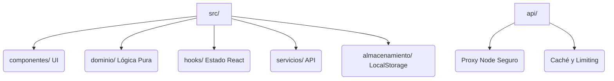

<div align="center">

# 🌦️ WeatherNow Decide

### _Tu ventana al clima y tus mejores decisiones en tiempo real_


[🚀 Inicio Rápido](#-inicio-rápido) • [✨ Características](#-características-principales) • [🛠️ Stack](#️-stack-tecnológico) • [📁 Arquitectura](#-arquitectura-del-proyecto) • [📝 SDD](#-cómo-trabajamos-sdd)

</div>

---

## 💡 ¿Qué es WeatherNow Decide?

**WeatherNow Decide** es una aplicación web moderna (SPA) en español que no solo te muestra el clima, sino que lo traduce en **decisiones accionables**.

¿Dudas si salir a correr? ¿No sabes si tender la ropa hoy? WeatherNow analiza datos meteorológicos, de calidad del aire y radiación UV para darte respuestas claras: **favorable**, **precaución** o **no recomendado**. Todo respaldado por una arquitectura robusta con un proxy seguro, soporte offline (PWA) y notificaciones de alerta.

> 📌 Desarrollado bajo la metodología **Spec-Driven Development (SDD)**: la especificación manda. Ver más en la [Constitución](docs/constitution.md).

---

## ✨ Características Principales

<details>
<summary><b>🌍 Exploración Global y Favoritos</b> (Clic para expandir)</summary>

- Búsqueda instantánea de ciudades en todo el mundo.
- Botón "Mi ubicación" para geolocalización rápida.
- Gestión de **lugares favoritos** (guardar, reordenar y eliminar), que se persisten en el navegador.
- Autocarga del último lugar consultado al abrir la app.
</details>

<details>
<summary><b>🧭 Decisiones Inteligentes</b> (Clic para expandir)</summary>

- Veredictos claros para actividades diarias: *Correr, Ciclismo, Caminar, Eventos al aire libre, Tender la ropa, Lavar el auto*.
- Motivos legibles y sugerencias de las mejores franjas del día para realizarlas.
</details>

<details>
<summary><b>🌞 Salud y Medio Ambiente</b> (Clic para expandir)</summary>

- Integración de **Índice UV, Calidad del Aire (US AQI) y Polen**.
- Avisos específicos para grupos sensibles y recomendaciones de protección solar.
</details>

<details>
<summary><b>🛡️ Arquitectura Segura y Offline</b> (Clic para expandir)</summary>

- **Proxy Seguro:** El cliente nunca conoce la clave de la API (`OPENWEATHER_API_KEY`). Toda petición pasa por un proxy propio en Node.
- **PWA (Progressive Web App):** Soporte offline gracias a Service Workers. Si te quedas sin conexión, verás el último pronóstico guardado.
- **Rendimiento:** Caché inteligente (10 min para clima, 30 min para pronóstico/aire) y rate limiting integrados.
</details>

<details>
<summary><b>🔔 Alertas y Personalización</b> (Clic para expandir)</summary>

- Selector global de unidades: **°C/km/h ↔ °F/mph**.
- Sistema de **alertas in-app** configurables para lluvia, viento, UV, calor y frío.
</details>

---

## 🚀 Inicio Rápido

Configura y arranca el entorno de desarrollo en menos de 2 minutos.

```bash
# 1️⃣ Clona e instala las dependencias
npm install

# 2️⃣ Configura las variables de entorno
# El proxy de Node requiere la clave de OpenWeather.
cp .env.example .env
# 🔑 Edita el archivo .env y añade tu OPENWEATHER_API_KEY.

# 3️⃣ Inicia el servidor de desarrollo
# Esto levanta Vite y monta automáticamente el proxy Node en /api
npm run dev
```

> 🎉 ¡Listo! Abre **`http://localhost:5173`** en tu navegador.

*Si necesitas correr el proxy por separado, usa `npm run api` (escuchará en `http://localhost:8787/api`).*

---

## 🛠️ Stack Tecnológico

Hemos elegido herramientas modernas para un rendimiento óptimo y una experiencia de desarrollo fluida.

| Frontend | Herramienta | Backend & Ops | Herramienta |
| :--- | :--- | :--- | :--- |
| **Framework** | React 19 | **Servidor** | Node.js (Proxy custom) |
| **Build Tool** | Vite 7 | **Cliente HTTP** | Axios 1.20 |
| **Estilos** | Tailwind CSS 4 | **Tests** | Vitest 5 + RTL 16 |
| **Gráficos** | Recharts 3 (Lazy) | **Calidad** | ESLint 9 + Prettier 3 |
| **Tipado** | TypeScript (JSDoc) | **PWA** | Service Worker Nativo |

---

## 📁 Arquitectura del Proyecto

Una estructura modular pensada para escalar.



<details>
<summary><b>Ver estructura de carpetas detallada</b></summary>

```text
📦 WeatherNow/
├── 📂 src/
│   ├── componentes/   comunes · clima · decision · salud · favoritos · alertas · planes
│   ├── dominio/       decisión (actividades y franjas) · salud · alertas · planes
│   ├── hooks/         useClima · usePronostico · useAire · useFavoritos · useAlertas…
│   ├── servicios/     cliente del proxy (/api)
│   ├── utilidades/    formateadores · transformadores · validadores · tiempo
│   ├── almacenamiento/ favoritos · preferencias · alertas · instantánea (localStorage)
│   ├── constantes/    configuración · mensajes · iconos · colores
│   └── vistas/        PaginaPrincipal
├── 📂 tests/          Vitest + Testing Library
├── 📂 api/            proxy Node: configuracion · cache · limite · metricas
├── 📂 public/         manifest.webmanifest · sw.js (PWA)
├── 📂 docs/ & specs/  Documentación SDD, planes y specs.
└── 📄 vite.config.js, eslint.config.js, vitest.config.js...
```
</details>

---

## 💻 Scripts Disponibles

Automatiza las tareas comunes con estos comandos:

| Comando | Acción |
| :--- | :--- |
| `npm run dev` | Inicia servidor de desarrollo con hot-reload + proxy. |
| `npm run build` | Compila para producción (`tsc --noEmit && vite build`). |
| `npm test` | Ejecuta la suite de pruebas unitarias. |
| `npm run typecheck` | Verifica tipos con TypeScript. |
| `npm run lint` | Analiza el código con ESLint. |
| `npm run format` | Aplica formato a todo el código con Prettier. |
| `npm run api` | Levanta el proxy Node de forma independiente. |

---

## 📝 Cómo trabajamos (SDD)

Este proyecto sigue la metodología **Spec-Driven Development**. No tocamos código sin antes definir qué vamos a hacer.

1. **Constitución:** Principios rectores en `docs/constitution.md`.
2. **Especificación (Spec):** Requisitos en notación EARS (`specs/NNN-nombre/spec.md`).
3. **Plan:** Diseño técnico de cómo resolverlo (`plan.md`).
4. **Tareas:** Checklist de ejecución (`tasks.md`).
5. **Validación:** Se implementa tarea a tarea y se cruza con los requerimientos originales.

> 🤝 **¿Quieres colaborar?** ¡Lee primero nuestro [AGENTS.md](AGENTS.md) y la especificación activa!

---
<div align="center">
Desarrollado con ❤️ combinando el poder de <b>React</b> y <b>Tailwind CSS 4</b>
</div>
